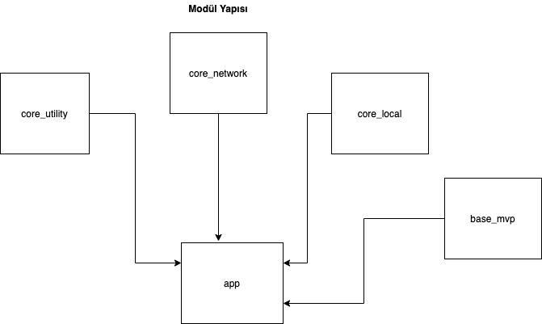
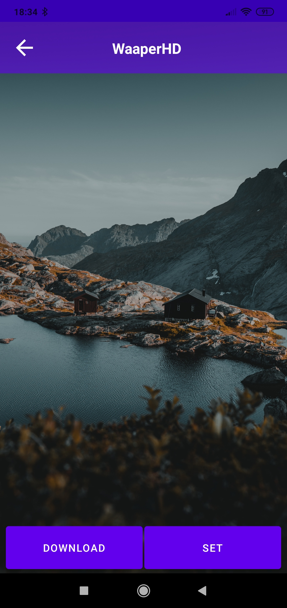
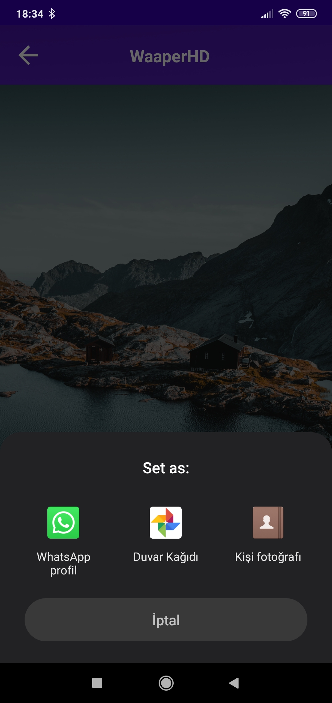

WaaperHD
# WaaperHD 
Proje webservisten aldığı görsel linklerini kullanıcıya sunup kullanıcının ister ise görseli indirip ister ise görseli telefonunda arkaplan olarak kullanılmasını sağlıyor

# Yapı

- Yapı **multi modüler** bir yapıdır. 
- Geliştirme yapılırken **MVP** kullanılmıştır.
- **Clean architecture** kullanılmıştır
- **One activity multiple fragment** yapıya sahiptir (Navigator olarak https://github.com/kemaltunc/basic-custom-navigation-component kullanılmıştır)
- **ViewBinding** kullanıldı
- Recylerview'da **Diffutil** kullanıldı
- Multi modül içinde DI için **Dagger 2** kullanıldı

## Modüler yapı
 

### **core_utility**

Projede herhangi bir t anında ihtiyaç olacak fonksiyonları içeren modüldür.

### **core_network**

İnternete çıkacak requestleri yöneten modüldür. RxJava kullanır

### **core_local**

Local veri depolamak için kullanılan modüldür

### **base_mvp**

UI kısmının base aldığı sınıfların bulunduğu modüldür

Projede genel olarak performansa ve kullanıcı deneyimine dikkat edildi. Bunun için pagination yaparken recylerviewın en altında request atmak yerine en alta yakınken request atması sağlandı. Ekran geçişlerinde kasma veya delay olmasın diye one activity multiple fragment kullanıldı.

# Code Generator

Projede fragment ve activityler el ile manuel oluşturulmak yerine https://github.com/hsmnzaydn/android-clean-feature-creator ile otomatik oluşturuldu. Projede kullanılan modüller kullanıldığı sürece generator sizin için minimum efor ile projenizin sınıflarını oluşturmayı sağlar.

# Fragment Yapısı

Fragmentin yaşam döngüsünden dolayı yönetmek zordur ve navigation architecture kullanımı oldukça zor ve karışık bunun için fragmentleri yönetmek için **Kemal Tunç'un** oluşturuduğu component(linki yukarıda) kullanıldı ve tüm view oluşurken işlemlerin tekrardan yapılmaması için initUI() ve againOpened() fonksiyonları oluşturuldu. Bir fragmente ilkkez giriliyor ise initUI() fonksiyonu tetiklenir ve tekrar bu fragmente gelinir ise againOpened() fonksiyonu tetiklenir.

# Bağımlılık Yönetimi
Proje multi modül olduğu için bağımlılıkları tüm modüller için teker teker yönetilmesi yerine **dependencies.gradle** dosyasında yönetildi. Burada yapılan bir değişiklik tüm modülleri etkileyecektir.

# Multi Modüle Compile Time
Proje multi modüle olunca projenin Compile süresi uzuyor bunu minimuma indirmek için modüllerin paralel compile olması ve gradle configürasyonlarının cachelenmesi sağlandı. Detaylar içinde **gradle.properties** dosyasına bakarbilirsiniz.

# Uygulama Görüntüleri

